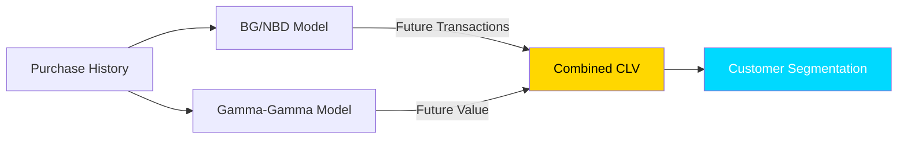

 

## 🎯 Value Tier Distribution

<table>
<tr>
<td align="center" width="25%">

### 💎
### **Platinum**
`5% (219)`
$3,850 CLV
**38% Revenue**

</td>
<td align="center" width="25%">

### 🥇
### **Gold**
`15% (656)`
$1,245 CLV
**28% Revenue**

</td>
<td align="center" width="25%">

### 🥈
### **Silver**
`30% (1,312)`
$485 CLV
**22% Revenue**

</td>
<td align="center" width="25%">

### 🥉
### **Bronze**
`50% (2,185)`
$125 CLV
**12% Revenue**

</td>
</tr>
</table>

## 🔬 The Models

 ## 📈 CLV Growth Trajectory
 - After 1st purchase:  $112  ████
- After 3rd purchase:  $285  ████████████ (+154% 🚀)
- After 6th purchase:  $580  ████████████████████ (+418%)
- After 12th purchase: $1,250 ████████████████████████████████ (+1,016%)

## 🎯 Insight: Getting customers to 3rd purchase is the critical threshold!

## 💰 CLV vs CAC Analysis

## "🏆 Referrals produce 4x higher CLV than paid ads!"

## 🎯 CLV by Acquisition Source
Source	Avg CLV	CLV:CAC
🌟 Referral	$1,285	25.7:1
🔍 Organic	$680	22.7:1
📧 Email	$520	17.3:1
💰 Paid Ads	$320	4.0:1

## 	Action	Impact
1	Invest up to $300 for Platinum-potential	Max value acquisition
2	Drive customers to 3rd purchase ASAP	+$500K revenue
3	3x referral program	+$200K CLV
4	Cut paid ad spend by 20%	Reallocate to email

## 🔬 The Models

## 📬 Let's Connect Professionally

 

> **"Great things in business are never done by one person. They're done by a team of people."** — Steve Jobs

 

### 🌟 I'm always excited to discuss new opportunities and collaborations

 

<table align="center" border="0">
<tr>
<td align="center" style="padding: 20px;">
  
</td>
<td align="center" style="padding: 20px;">
  
</td>
</tr>
</table>

 

### 🌐 Also Find Me On

  <a href="https://github.com/12Anushree">
    

 

### ⚡ Response Time: **Usually within 24 hours**

